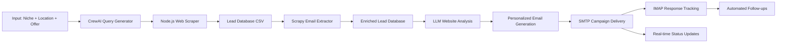

# NicheAppointment

**LLM-Powered Business Outreach Automation Platform**

A comprehensive solution for automated lead generation, email personalization, and campaign management that combines web scraping, AI-driven content personalization, and intelligent email automation to streamline B2B outreach workflows.

## Overview

NicheAppointment automates the entire lead generation and outreach pipeline by discovering businesses within specified niches and locations, extracting contact information, personalizing messaging using large language models, and managing email campaigns with automated follow-ups and response tracking.

### Key Features

- ** Intelligent Lead Discovery**: Generates targeted search queries using CrewAI and scrapes Google Maps for business listings
- ** Email Enrichment**: Extracts and validates email addresses from business websites using advanced pattern matching
- ** AI-Powered Personalization**: Creates customized email content based on website analysis and target audience
- ** Campaign Management**: Automated SMTP delivery with IMAP-based response tracking and follow-up sequences
- ** Real-time Monitoring**: Server-sent events (SSE) for live campaign status updates and comprehensive logging

## Architecture



## Technology Stack

- **Backend**: Python (Flask, Scrapy, pandas), Node.js
- **AI/ML**: CrewAI, LangChain, OpenAI GPT
- **Email**: SMTP/IMAP protocols with Gmail integration
- **Data Processing**: Pandas, CSV/Excel export capabilities
- **Frontend**: HTML/JavaScript with Server-Sent Events

## Project Structure

```
├── landing_page/              # Web interface
├── src/
│   └── lead_scraper/          # Node.js scraping module
├── email_spider.py            # Scrapy-based email extraction
├── email_automation.py        # SMTP/IMAP campaign management
├── personalization.py         # AI-powered content generation
├── main.py                    # Flask API server
├── requirements.txt           # Python dependencies
├── package.json              # Node.js dependencies
├── Dockerfile                # Container configuration
└── .env.example              # Environment template
```

## Prerequisites

- Python 3.11+
- Node.js 18+
- SMTP/IMAP email account (Gmail with App Password recommended)
- OpenAI API key

## Installation

### Local Development Setup

```bash
# Clone repository
git clone https://github.com/your-org/nicheappointment.git
cd nicheappointment

# Create Python virtual environment
python -m venv .venv
source .venv/bin/activate  # On Windows: .venv\Scripts\activate

# Install Python dependencies
pip install -r requirements.txt

# Install Node.js dependencies
cd src/lead_scraper
npm install
cd ../../

# Configure environment variables
cp .env.example .env
# Edit .env with your actual credentials
```

### Docker Deployment

```bash
docker build -t nicheappointment .
docker run --env-file .env -p 8080:8080 nicheappointment
```

## Configuration

Configure the following environment variables in `.env`:

```env
# AI Services
OPENAI_API_KEY=your_openai_key
SERPER_API_KEY=optional_serper_key
CLAUDE_API_KEY=optional_claude_key

# Email Configuration
SMTP_USER=your@email.com
SMTP_PASSWORD=your_app_password
SMTP_SERVER=smtp.gmail.com
SMTP_PORT=587
IMAP_SERVER=imap.gmail.com

# Application Settings
PORT=8080
LOG_LEVEL=INFO
```

## Usage

### Starting the Application

```bash
# Local development
source .venv/bin/activate
python main.py
```

The application will be available at `http://localhost:8080`

### API Endpoints

#### Campaign Management

**Start Campaign**
```http
POST /api/start-campaign
Content-Type: application/json

{
  "niche": "dental clinics",
  "location": "Valencia, Spain",
  "website": "https://yourservice.com",
  "name": "Your Name",
  "offer": "Free audit with 3 concrete improvements in 7 days",
  "gmail": "your@email.com",
  "appPassword": "your-app-password"
}
```

**Campaign Status (Server-Sent Events)**
```http
GET /api/campaign-status
```

Response format:
```json
{
  "type": "status|log|error",
  "message": "Campaign progress update"
}
```

### Campaign Workflow

1. **Query Generation**: AI generates targeted search terms for the specified niche and location
2. **Lead Scraping**: Node.js scraper extracts business information from Google Maps
3. **Email Discovery**: Scrapy spider visits websites to extract and validate email addresses
4. **Content Personalization**: LLM analyzes target websites and generates personalized email content
5. **Campaign Execution**: Automated email delivery with response tracking and follow-up sequences

## Data Management

### Generated Files

- `src/lead_scraper/business_leads.csv` - Raw scraped leads
- `src/lead_scraper/business_leads_with_emails.csv` - Email-enriched leads
- `src/lead_scraper/business_leads_with_emails.xlsx` - Excel export
- `data/registered_users.csv` - User registration data

### Sample Data Structure

```csv
Name,Website,Email,Decision Maker,Phone,Address
ACME Dental,https://acmedental.com,info@acmedental.com,Dr. Smith,555-0123,"123 Main St"
```

## Testing

### Quick Validation Tests

```bash
# Test personalization module
python -c "
from personalization import personalize_user_offer
result = personalize_user_offer('https://example.com', 'Free consultation offer')
print(result)
"

# Test API endpoint
curl -N -H "Content-Type: application/json" \
  -d '{"niche":"dental clinics","location":"Madrid","website":"https://example.com","name":"Test","offer":"Free audit","gmail":"test@example.com","appPassword":"test"}' \
  http://localhost:8080/api/start-campaign
```

## Security & Compliance

### Data Protection
- Environment variables for sensitive credentials
- No hardcoded API keys or passwords
- Automatic credential rotation support
- PII data minimization and retention policies

### Web Scraping Ethics
- Respects robots.txt and terms of service
- Implements rate limiting and delays
- Uses AUTOTHROTTLE for responsible scraping

### Email Compliance
- SPF/DKIM/DMARC domain authentication
- User consent for personalized outreach
- Unsubscribe mechanisms
- GDPR compliance considerations

## Performance & Scalability

### Current Limitations
- Synchronous processing pipeline
- In-memory state management
- Basic error handling and retry logic

### Recommended Improvements
- **Queue System**: Implement Redis/RQ or Celery for asynchronous processing
- **Database**: Migrate from CSV to SQLite/PostgreSQL for better data management
- **Monitoring**: Add comprehensive metrics and alerting
- **Testing**: Expand unit test coverage with synthetic data fixtures
- **API Security**: Implement authentication and rate limiting

## Contributing

1. Fork the repository
2. Create a feature branch (`git checkout -b feature/new-feature`)
3. Commit changes (`git commit -am 'Add new feature'`)
4. Push to branch (`git push origin feature/new-feature`)
5. Create Pull Request

## License

MIT License - see [LICENSE](LICENSE) file for details.

## Support

For issues and questions, please open a GitHub issue with detailed information about your environment and the problem encountered.
